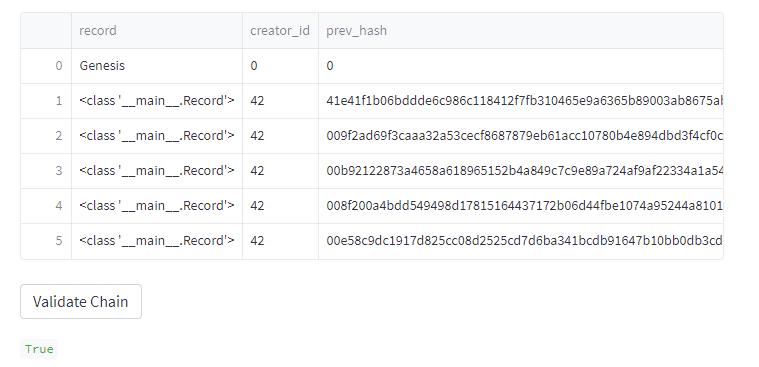
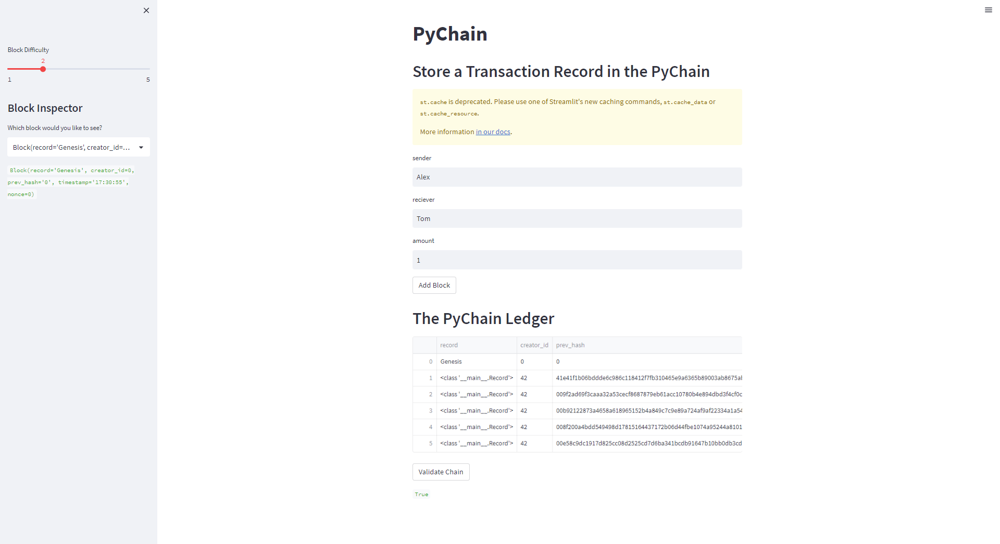

# Assignment: PyChain

## Summary

This repo is a streamlit application which simulates blockchain transaction.

### Details:

 The fields displayed are that of a sender, reciever and the amount which was intended to be sent, then the transaction is added to the blockchain for verifiablity. 
 The transaction is then added to the ledger where it's previous hash, timestamp and nonce are recorded along with who created each transaction.
 
 The validate chain button will do just that make sure that all blockchain is valid that no one has tampered with the chain.
 
 As long as the chain is valid the button will return true.

